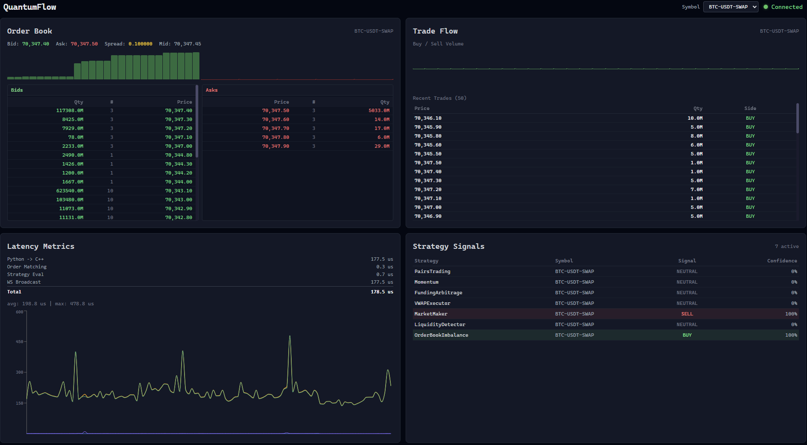

# QuantumFlow

Low-latency trading engine with a Python market-data pipeline and a live web UI.

## Highlights
- C++ limit-order-book core with pluggable strategies
- Python websocket ingest and normalization pipeline
- Bridge ingress from Python to C++ (Unix socket IPC + in-process fallback)
- Optional WebSocket server + dashboard

## Dashboard Preview
<p align="center">
  
  <br />
  <em>Live UI: Order Book, Trade Flow, Latency Metrics, and Strategy Signals.</em>
</p>

## Quick Start
1. Build the C++ engine:
   ```bash
   cmake -S . -B build
   cmake --build build
   ```
2. Install the Python pipeline deps:
   ```bash
   python -m pip install -r pipeline/requirements.txt
   ```
3. Run the engine (defaults to WebUI mode):
   ```bash
   ./build/quantumflow --symbols BTC-USDT-SWAP,ETH-USDT-SWAP
   ```
4. Run the Python pipeline (in another terminal):
   ```bash
   cd pipeline
   PYTHONPATH=. python -m src.app \
     --symbols BTC-USDT-SWAP,ETH-USDT-SWAP \
     --channels books5,trades \
     --cpp-bridge
   ```

## Project Layout
```text
quantumflow/
├── main.cpp                 # C++ engine entrypoint
├── CMakeLists.txt           # Build configuration
├── Makefile                 # Common dev/build/run commands
├── bridge/                  # Python -> C++ ingress bridge
├── common/                  # Shared C++ data models/utilities
├── orderbook/               # Limit order book core + tests/bench
├── pipeline/                # Python market-data ingest/normalize/sinks
├── strategies/              # Strategy interfaces + implementations
├── ws/                      # C++ WebSocket server + JSON serializers
├── web/                     # React/Tailwind dashboard
├── tests/                   # C++ unit tests (engine/bridge/strategies)
├── third_party/             # Dependency setup via CMake FetchContent
├── graphics/
│   └── include/memory/allocator.h  # Shared allocator utilities
└── screenshot/              # README/UI assets
```

## Notes
Pass `--headless` to run without the WebUI, and `--symbols` to set instruments.
