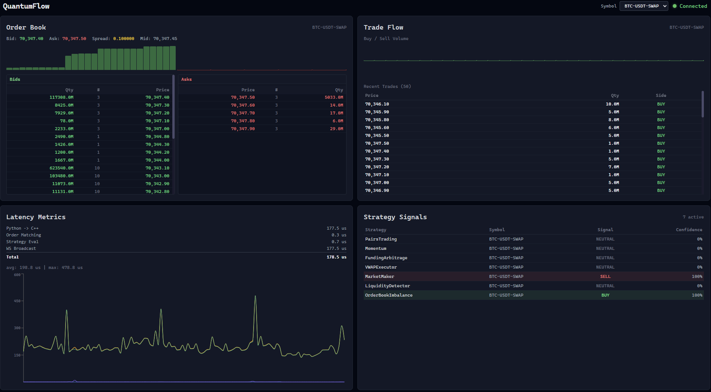

# QuantumFlow

Low-latency trading engine with a C++ market-data pipeline and a live web UI.

## Highlights
- C++ limit-order-book core with pluggable strategies
- C++ websocket ingest and normalization pipeline (OKX over TLS)
- Bridge ingress into the C++ engine (Unix socket IPC)
- Optional WebSocket server + dashboard

## Prerequisites
- CMake 3.16+
- C++20 compiler (GCC/Clang)
- OpenSSL + zlib (for the C++ market-data pipeline WebSocket client)
- Node.js 18+ (optional, for local web dashboard development)

Linux/macOS is recommended because the engine/pipeline bridge uses Unix-domain sockets.

## Dashboard Preview
<p align="center">
  
  <br />
  <em>Live UI: Order Book, Trade Flow, Latency Metrics, and Strategy Signals.</em>
</p>

## Quick Start (3 terminals)
1. Build:
   ```bash
   cmake -S . -B build
   cmake --build build
   ```
2. Terminal A: start the engine (WebUI mode):
   ```bash
   ./build/quantumflow \
     --symbols BTC-USDT-SWAP,ETH-USDT-SWAP \
     --ws-port 9001 \
     --bridge-socket /tmp/quantumflow_bridge.sock \
     --pipeline-control-socket /tmp/quantumflow_pipeline_ctrl.sock
   ```
3. Terminal B: start the C++ market-data pipeline and push into the C++ engine:
   ```bash
   ./build/quantumflow_pipeline \
     --symbols BTC-USDT-SWAP,ETH-USDT-SWAP \
     --channels books5,trades \
     --cpp-bridge \
     --bridge-socket /tmp/quantumflow_bridge.sock \
     --control-socket /tmp/quantumflow_pipeline_ctrl.sock
   ```
4. Terminal C (optional): run the React dashboard:
   ```bash
   cd web
   npm install
   npm run dev
   ```
   Then open `http://localhost:5173` (the app connects to `ws://localhost:9001`).

## How To Use The Engine
### 1) Run in live mode (recommended)
- Start `quantumflow` first.
- Start the C++ pipeline (`quantumflow_pipeline`) with `--cpp-bridge`.
- View metrics/order book/trades in the web app.
- Use the symbol selector in the UI to request runtime symbol changes (sent through the control socket).

### 2) Run headless (no WebSocket UI)
```bash
./build/quantumflow --headless --symbols BTC-USDT-SWAP,ETH-USDT-SWAP
```
This keeps the strategy/LOB engine running without the WebSocket broadcast/UI loop.

### 3) Use the Makefile shortcuts
```bash
make build          # Configure + build C++ engine
make run-engine     # Run engine (WebUI mode + bridge sockets)
make pipeline-run   # Build + run the C++ pipeline with --cpp-bridge
make web            # Start web dashboard dev server
make test           # Run C++ tests
make headless       # Build headless configuration
```

### Engine CLI flags
- `--symbols BTC-USDT-SWAP,ETH-USDT-SWAP` comma-separated instruments
- `--headless` disable WebUI broadcasting
- `--ws-port 9001` WebSocket server port for UI clients
- `--bridge-socket /tmp/quantumflow_bridge.sock` pipeline->C++ ingress socket
- `--pipeline-control-socket /tmp/quantumflow_pipeline_ctrl.sock` runtime symbol control socket

## IDE / IntelliSense (`compile_commands.json`)
For C/C++ editor diagnostics (for example in VS Code), this repo uses
`compile_commands.json` at the project root (symlink to `build/compile_commands.json`).

If you see include-path squiggles, regenerate it by reconfiguring:
```bash
make configure
```

## Project Layout
```text
quantumflow/
├── main.cpp                 # C++ engine entrypoint
├── CMakeLists.txt           # Build configuration
├── Makefile                 # Common dev/build/run commands
├── bridge/                  # Shared-memory IPC helpers for the engine
├── common/                  # Shared C++ data models/utilities
├── orderbook/               # Limit order book core + tests/bench
├── pipeline/                # C++ market-data ingest/normalize/sinks
├── strategies/              # Strategy interfaces + implementations
├── ws/                      # C++ WebSocket server + JSON serializers
├── web/                     # React/Tailwind dashboard
├── tests/                   # C++ unit tests (engine/bridge/strategies)
├── third_party/             # Dependency setup via CMake FetchContent
├── graphics/
│   └── include/memory/allocator.h  # Shared allocator utilities
└── screenshot/              # README/UI assets
```
